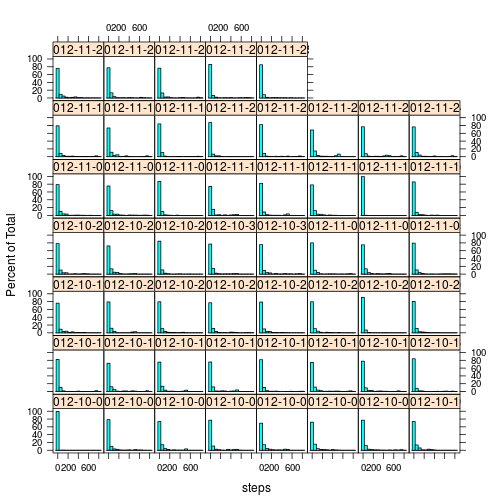
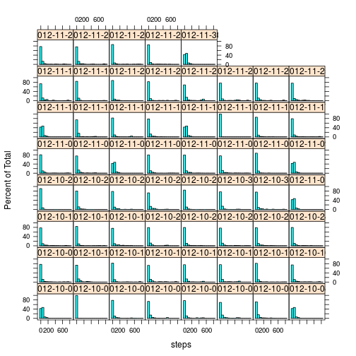
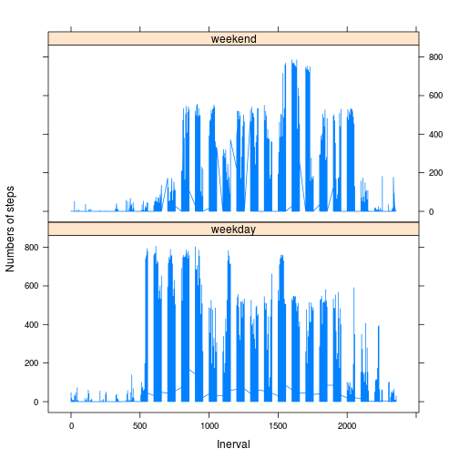

# Reproducible Research: Peer Assessment 1


## Loading and preprocessing the data


```r
# create the data folder

if (!file.exists("data")) {
    dir.create("data")
}

# unzip the file use utils package use 'install.packages('utils')' to
# install

library(utils)
unzip("./activity.zip", exdir = "./data/")

# read the data

DF <- read.csv("./data/activity.csv")

# change the class of 'date' variable from factor to date

DF$date <- as.Date(DF$date, "%Y-%m-%d")
```


I loaded the data into a data frame called DF with the variable 'date' changed to
a date class.

## What is mean total number of steps taken per day?


```r
# ignore the NA

DFn <- DF[!is.na(DF$steps), ]

# make a histogram of the total number of steps taken each day

library(lattice)
with(DFn, histogram(~steps | date))
```

 


Mean total number of steps taken per day could be get from the following code.


```r
# calculate and report the mean and median total number of steps taken per
# day

with(DFn, tapply(steps, date, mean))
```

```
## 2012-10-02 2012-10-03 2012-10-04 2012-10-05 2012-10-06 2012-10-07 
##     0.4375    39.4167    42.0694    46.1597    53.5417    38.2465 
## 2012-10-09 2012-10-10 2012-10-11 2012-10-12 2012-10-13 2012-10-14 
##    44.4826    34.3750    35.7778    60.3542    43.1458    52.4236 
## 2012-10-15 2012-10-16 2012-10-17 2012-10-18 2012-10-19 2012-10-20 
##    35.2049    52.3750    46.7083    34.9167    41.0729    36.0938 
## 2012-10-21 2012-10-22 2012-10-23 2012-10-24 2012-10-25 2012-10-26 
##    30.6285    46.7361    30.9653    29.0104     8.6528    23.5347 
## 2012-10-27 2012-10-28 2012-10-29 2012-10-30 2012-10-31 2012-11-02 
##    35.1354    39.7847    17.4236    34.0938    53.5208    36.8056 
## 2012-11-03 2012-11-05 2012-11-06 2012-11-07 2012-11-08 2012-11-11 
##    36.7049    36.2465    28.9375    44.7326    11.1771    43.7778 
## 2012-11-12 2012-11-13 2012-11-15 2012-11-16 2012-11-17 2012-11-18 
##    37.3785    25.4722     0.1424    18.8924    49.7882    52.4653 
## 2012-11-19 2012-11-20 2012-11-21 2012-11-22 2012-11-23 2012-11-24 
##    30.6979    15.5278    44.3993    70.9271    73.5903    50.2708 
## 2012-11-25 2012-11-26 2012-11-27 2012-11-28 2012-11-29 
##    41.0903    38.7569    47.3819    35.3576    24.4688
```

```r

with(DFn, tapply(steps, date, median))
```

```
## 2012-10-02 2012-10-03 2012-10-04 2012-10-05 2012-10-06 2012-10-07 
##          0          0          0          0          0          0 
## 2012-10-09 2012-10-10 2012-10-11 2012-10-12 2012-10-13 2012-10-14 
##          0          0          0          0          0          0 
## 2012-10-15 2012-10-16 2012-10-17 2012-10-18 2012-10-19 2012-10-20 
##          0          0          0          0          0          0 
## 2012-10-21 2012-10-22 2012-10-23 2012-10-24 2012-10-25 2012-10-26 
##          0          0          0          0          0          0 
## 2012-10-27 2012-10-28 2012-10-29 2012-10-30 2012-10-31 2012-11-02 
##          0          0          0          0          0          0 
## 2012-11-03 2012-11-05 2012-11-06 2012-11-07 2012-11-08 2012-11-11 
##          0          0          0          0          0          0 
## 2012-11-12 2012-11-13 2012-11-15 2012-11-16 2012-11-17 2012-11-18 
##          0          0          0          0          0          0 
## 2012-11-19 2012-11-20 2012-11-21 2012-11-22 2012-11-23 2012-11-24 
##          0          0          0          0          0          0 
## 2012-11-25 2012-11-26 2012-11-27 2012-11-28 2012-11-29 
##          0          0          0          0          0
```


## What is the average daily activity pattern?

Make a time series plot (i.e. type = "l") of the 5-minute interval (x-axis)
and the average number of steps taken, averaged across all days (y-axis)


```r
plot(unique(DFn$interval), with(DFn, tapply(steps, interval, mean)), xlab = "Interval", 
    ylab = "Numbers of steps", type = "l")
```

 


Which 5-minute interval, on average across all the days in the dataset,
contains the maximum number of steps?


```r
names(which.max(with(DFn, tapply(steps, interval, mean))))
```

```
## [1] "835"
```


It seems that around 8:35AM is the most active time segment for the anonymous 
individual.

## Imputing missing values

Note that there are a number of days/intervals where there are missing values
(coded as NA). The presence of missing days may introduce bias into some
calculations or summaries of the data.

The total number of missing values in the dataset is get by the following code.
In fact, only the steps have NA.


```r
sum(!complete.cases(DF))
```

```
## [1] 2304
```


Use the mean for that 5-minute interval to fill in the missing NA for there are 
patterns during a day and create a new dataset called DFnew with the missing 
data filled in.


```r
group <- split(DF, DF$interval)
DFnew <- data.frame(DF[0, ])
findNA <- function(x) {
    x[which(!complete.cases(x)), 1] <- mean(x[-which(!complete.cases(x)), 1])
    x
}
for (i in 1:288) {
    DFnew <- rbind(DFnew, findNA(group[[i]]))
}
```


Plot histogram of the total number of steps taken each day and calculate the 
mean and median total number of steps taken per day. 


```r
library(lattice)
with(DFnew, histogram(~steps | date))
```

 

```r
with(DFnew, tapply(steps, date, mean))
```

```
## 2012-10-01 2012-10-02 2012-10-03 2012-10-04 2012-10-05 2012-10-06 
##    37.3826     0.4375    39.4167    42.0694    46.1597    53.5417 
## 2012-10-07 2012-10-08 2012-10-09 2012-10-10 2012-10-11 2012-10-12 
##    38.2465    37.3826    44.4826    34.3750    35.7778    60.3542 
## 2012-10-13 2012-10-14 2012-10-15 2012-10-16 2012-10-17 2012-10-18 
##    43.1458    52.4236    35.2049    52.3750    46.7083    34.9167 
## 2012-10-19 2012-10-20 2012-10-21 2012-10-22 2012-10-23 2012-10-24 
##    41.0729    36.0938    30.6285    46.7361    30.9653    29.0104 
## 2012-10-25 2012-10-26 2012-10-27 2012-10-28 2012-10-29 2012-10-30 
##     8.6528    23.5347    35.1354    39.7847    17.4236    34.0938 
## 2012-10-31 2012-11-01 2012-11-02 2012-11-03 2012-11-04 2012-11-05 
##    53.5208    37.3826    36.8056    36.7049    37.3826    36.2465 
## 2012-11-06 2012-11-07 2012-11-08 2012-11-09 2012-11-10 2012-11-11 
##    28.9375    44.7326    11.1771    37.3826    37.3826    43.7778 
## 2012-11-12 2012-11-13 2012-11-14 2012-11-15 2012-11-16 2012-11-17 
##    37.3785    25.4722    37.3826     0.1424    18.8924    49.7882 
## 2012-11-18 2012-11-19 2012-11-20 2012-11-21 2012-11-22 2012-11-23 
##    52.4653    30.6979    15.5278    44.3993    70.9271    73.5903 
## 2012-11-24 2012-11-25 2012-11-26 2012-11-27 2012-11-28 2012-11-29 
##    50.2708    41.0903    38.7569    47.3819    35.3576    24.4688 
## 2012-11-30 
##    37.3826
```

```r
with(DFnew, tapply(steps, date, median))
```

```
## 2012-10-01 2012-10-02 2012-10-03 2012-10-04 2012-10-05 2012-10-06 
##      34.11       0.00       0.00       0.00       0.00       0.00 
## 2012-10-07 2012-10-08 2012-10-09 2012-10-10 2012-10-11 2012-10-12 
##       0.00      34.11       0.00       0.00       0.00       0.00 
## 2012-10-13 2012-10-14 2012-10-15 2012-10-16 2012-10-17 2012-10-18 
##       0.00       0.00       0.00       0.00       0.00       0.00 
## 2012-10-19 2012-10-20 2012-10-21 2012-10-22 2012-10-23 2012-10-24 
##       0.00       0.00       0.00       0.00       0.00       0.00 
## 2012-10-25 2012-10-26 2012-10-27 2012-10-28 2012-10-29 2012-10-30 
##       0.00       0.00       0.00       0.00       0.00       0.00 
## 2012-10-31 2012-11-01 2012-11-02 2012-11-03 2012-11-04 2012-11-05 
##       0.00      34.11       0.00       0.00      34.11       0.00 
## 2012-11-06 2012-11-07 2012-11-08 2012-11-09 2012-11-10 2012-11-11 
##       0.00       0.00       0.00      34.11      34.11       0.00 
## 2012-11-12 2012-11-13 2012-11-14 2012-11-15 2012-11-16 2012-11-17 
##       0.00       0.00      34.11       0.00       0.00       0.00 
## 2012-11-18 2012-11-19 2012-11-20 2012-11-21 2012-11-22 2012-11-23 
##       0.00       0.00       0.00       0.00       0.00       0.00 
## 2012-11-24 2012-11-25 2012-11-26 2012-11-27 2012-11-28 2012-11-29 
##       0.00       0.00       0.00       0.00       0.00       0.00 
## 2012-11-30 
##      34.11
```


These values are differ from the estimates from the first part of the assignment
depending on the impute method.

## Are there differences in activity patterns between weekdays and weekends?


```r
# add 'weekday' variable

DFnew$weekday <- "weekend"
DFnew[!(weekdays(DFnew$date) == "Sunday" | weekdays(DFnew$date) == "Saturday"), 
    ]$weekday <- "weekday"

# plot the differences and the log 10 based version in the comment line

library(lattice)
with(DFnew, xyplot(steps ~ interval | weekday, type = "l", layout = c(1, 2), 
    xlab = "Inerval", ylab = "Numbers of steps"))
```

 

```r
# with(DFnew,xyplot(steps~interval|weekday,type='l',layout=c(1,2),xlab='Inerval',ylab='Numbers
# of steps'))
```


The differeces is clear from the plot, the steps is earlier on weekday and the
anonymous individual may like to walk on weekend evening. I noticed the figure 
in the instruction use a log based transform which I don't think is useful for 
this problem to find the patterns.

